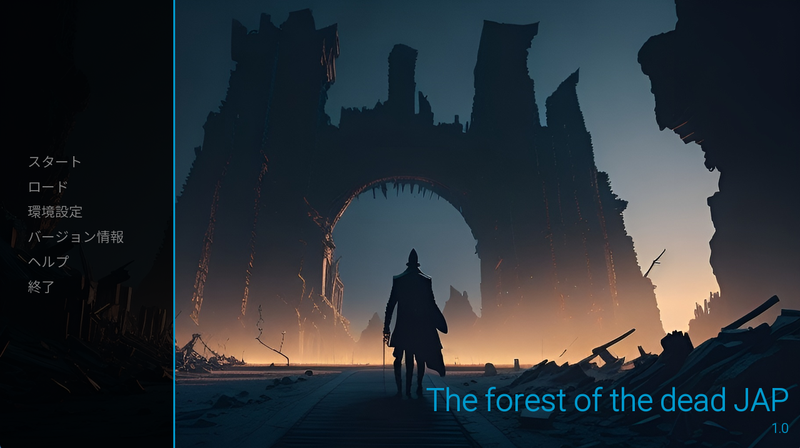

# The Forest of the Dead

"The Forest of the Dead" is an interactive visual novel game developed using Ren'Py.

**Note**: Only the Japanese version of the game is available for now.

## Table of Contents

- [About](#about)
- [Game Overview](#game-overview)
- [Getting Started](#getting-started)
- [Game Screenshots](#game-screenshots)
- [Contributing](#contributing)
- [License](#license)

## About

"The Forest of the Dead" is an atmospheric visual novel that immerses players in a mysterious and dark fantasy world. Dive into a captivating story, make choices that shape the narrative, and uncover the secrets hidden within the forest.

## Game Overview

- **Characters:**
  - Narrator: Your guide through the game.
  - Legion 1: A member of the Roman legion.
  - Legion 2: Another legionnaire.

- **Music:**
  - "Koster" by Ruslan-dev-Free-Fire
  - "River" by Ruslan-dev-Free-Fire
  - "Happy Theme" by Ruslan-dev-Free-Fire

## Getting Started

To play "The Forest of the Dead," follow these steps:

1. Clone this repository to your local machine using `git clone`.

2. Ensure you have Ren'Py installed. If not, you can download it [here](https://www.renpy.org/latest.html).

3. Open Ren'Py and choose "Open Project." Select the game directory.

4. Run the game by clicking the "Launch Project" button in Ren'Py.

5. Enjoy the game and make choices that affect the story!

## Game Screenshot

## Contributing

Contributions to the game are welcome! If you want to contribute, please follow these guidelines:

1. Fork the repository.

2. Create a new branch with a descriptive name for your feature or bug fix.

3. Make your changes and test them thoroughly.

4. Create a pull request with a clear description of your changes.

5. Your pull request will be reviewed, and once approved, it will be merged into the main repository.

## License

This game is licensed under the MIT License - see the [LICENSE.md](LICENSE.md) file for details.
